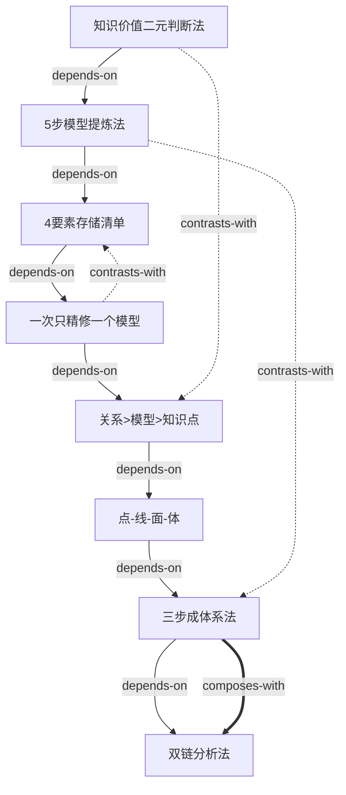

# 1小时构建知识体系 — Skill Index

> 本书由 cangjie-skill 蒸馏，共产出 **1** 个主 skill（`knowledge-system-builder`），内含 **8** 个通过三重验证的原子方法论单元。
> 处理时间: 2026-08-26

## 关于这本书

- **作者**: 原创课件作者（网络流传）
- **出版年**: 约 2023–2024
- **一句话主旨**: 教人从「混乱无序的信息收藏者」转变为「拥有结构化知识体系、能看透事物本质」的认知经营者
- **整书理解**: 见 [BOOK_OVERVIEW.md](./BOOK_OVERVIEW.md)
- **精华长文** (不读全书看这篇): [DIGEST.md](./DIGEST.md)
- **术语词典**: [GLOSSARY.md](./GLOSSARY.md)

---

## Skill 列表 (按主题分组)

### 认知框架层

- [`f02 点-线-面-体进阶模型`](./skills-draft/ria-plus-compilation.md#f02--点-线-面-体进阶模型) — 描述知识从碎片化到体系化的四个递进层级
- [`f03 知识价值二元判断法`](./skills-draft/ria-plus-compilation.md#f03--知识价值二元判断法) — 用「世界观+方法论」二元标准过滤信息噪音

### 提炼加工层

- [`f04 5步模型提炼法`](./skills-draft/ria-plus-compilation.md#f04--5步模型提炼法) — 把任何内容提炼成 4–5 字模型的流水线
- [`p03 4要素存储清单`](./skills-draft/ria-plus-compilation.md#p03--4要素存储清单) — 存储知识时的强制检查清单

### 组装体系层

- [`f05 主题-框架-结构 三步成体系法`](./skills-draft/ria-plus-compilation.md#f05--主题-框架-结构-三步成体系法) — 将零散模型组装成完整知识体系
- [`p01 一次只精修一个模型`](./skills-draft/ria-plus-compilation.md#p01--一次只精修一个模型) — 防止知识体系烂尾的核心纪律
- [`p02 关系 > 模型 > 知识点`](./skills-draft/ria-plus-compilation.md#p02--关系--模型--知识点) — 知识管理中的价值优先级金字塔

### 应用本质层

- [`f06 因果链+层次链 双链分析法`](./skills-draft/ria-plus-compilation.md#f06--因果链层次链-双链分析法) — 利用体系看透事物本质的操作路径

---

## 引用图



图例:
- `-->`  depends-on
- `-.->` contrasts-with
- `===>` composes-with

---

## 推荐学习顺序

(从依赖图的叶子节点开始，向上)

1. **f03 知识价值二元判断法** — 最基础，决定"学什么"
2. **f04 5步模型提炼法** — 学了之后"怎么加工"
3. **p03 4要素存储清单** — 加工后"怎么存"
4. **p01 一次只精修一个模型** — 存储时的"纪律"
5. **p02 关系 > 模型 > 知识点** — 建立"优先级意识"
6. **f02 点-线-面-体** — 理解"层级地图"
7. **f05 三步成体系法** — 动手"组装"
8. **f06 双链分析法** — 最终"应用"

---

## 安装使用

本目录是构建产物，宿主不会从这里加载 skill。要让 agent 真正调用，
把优化后的 skill 目录作为 `knowledge-system-builder` 使用:

```bash
cp -r knowledge-system-builder ~/.workbuddy/skills/
```

---

## 审计轨迹

- 候选单元池: [candidates/](./candidates/)
- 被淘汰的候选 (含原因): [rejected/](./rejected/)
- BOOK_OVERVIEW: [BOOK_OVERVIEW.md](./BOOK_OVERVIEW.md)
- 三重验证结果: [verified.md](./verified.md)
- RIA++ 草稿: [skills-draft/ria-plus-compilation.md](./skills-draft/ria-plus-compilation.md)
